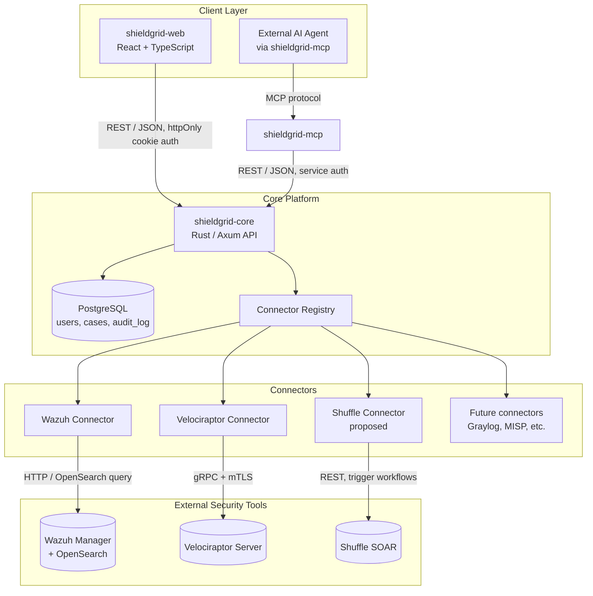
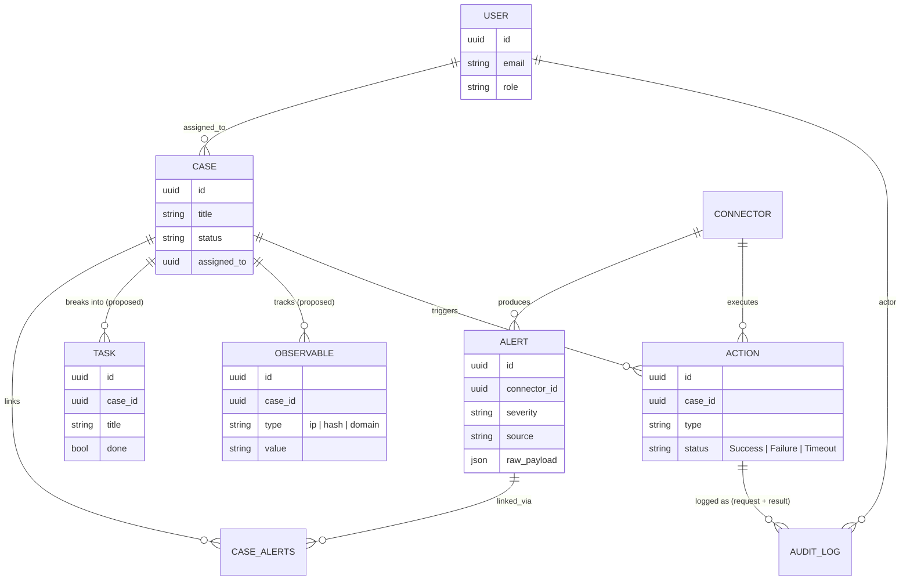
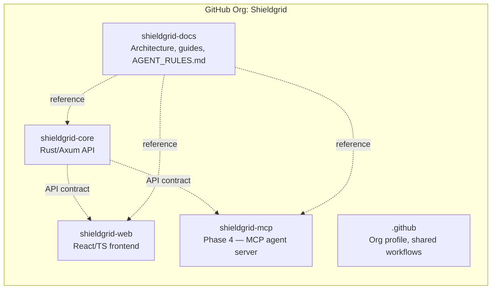
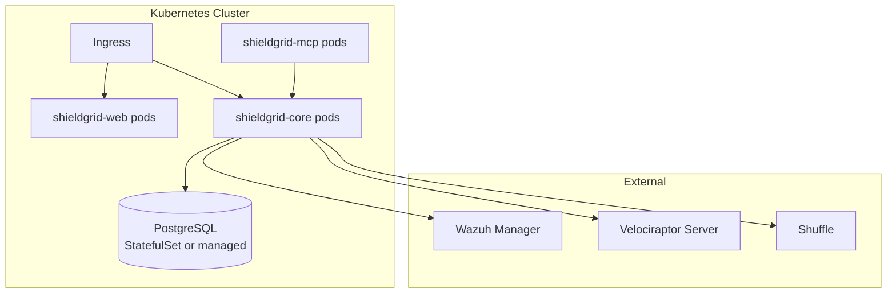

# Shieldgrid — Final Vision & Architecture

This document describes the end-state Shieldgrid platform: what it does, how its pieces fit together, and what's already built versus proposed. It's a living document — update it as real decisions get made, don't treat it as fixed once written.

> A note on how this was researched: descriptions of external tools (Shuffle, TheHive) below are based on their public documentation and marketing material only. Per `AGENT_RULES.md` Rule 1, no external project's source code was read to produce this document, and none should be read when actually implementing anything inspired by them.

---

## 1. Vision

Shieldgrid is a single-pane-of-glass SOC operations platform: it unifies alerts, forensic/endpoint data, and response actions from multiple independent security tools into one coherent system — visibility, investigation, and action, in one place, instead of an analyst juggling five browser tabs.

It is not a SIEM, not an EDR, not a SOAR — it *sits above* tools that already do those things well, and gives an analyst one place to work.

---

## 2. Product Pillars

| Pillar | What it means | Status |
|---|---|---|
| **Unified visibility** | Alerts from any connected tool, normalized into one feed | ✅ Built (Wazuh, Velociraptor) |
| **Investigation** | Cases, linked evidence, collaboration | ✅ Built (core case management) |
| **Action** | Respond directly from the platform, not just observe | ✅ Built (Velociraptor isolate/unisolate) |
| **Automation** | Let repetitive response work run itself | 🔜 Proposed (Shuffle integration) |
| **Rich case workflows** | Deeper investigation tooling — observables, IOC tracking, alert-to-case promotion at scale | 🔜 Proposed (native, TheHive-inspired) |
| **Agent-assisted operations** | An AI agent that can query and act within Shieldgrid | 🔜 Planned (Phase 4, `shieldgrid-mcp`) |

---

## 3. System Architecture (end-state)

---

## 4. Connector Ecosystem

Every integration follows the same pattern established with Wazuh and Velociraptor: a research spike → an implementation ticket with mandatory robustness requirements → a live-validation ticket. No exceptions, regardless of how simple a new tool looks at first glance.

### Built

| Connector | Role | Capability |
|---|---|---|
| **Wazuh** | SIEM / log-based detection | Read alerts (via OpenSearch) |
| **Velociraptor** | Endpoint forensics & response | Read alerts (via VQL artifacts) + act (isolate/unisolate) |

### Proposed — Shuffle (SOAR / Automation)

Shuffle is an open-source security orchestration and automation platform — analysts build visual workflows ("playbooks") that connect to hundreds of external tools and can run automatically on triggers (e.g. "when a new Critical alert arrives, auto-enrich the IP and post to Slack").

**Why add it, specifically:** Shieldgrid can *detect* (Wazuh) and *act* (Velociraptor), but has no automation layer — every response today requires a human to click a button. A Shuffle connector would let Shieldgrid **trigger** a Shuffle workflow directly from a case (e.g. "run IOC enrichment," "notify on-call") and **receive** workflow results back into the case timeline. This is integrated the same way Wazuh/Velociraptor are — as a client calling Shuffle's own API — never by incorporating Shuffle's own source code.

**Proposed shape:**
- `push_action`-style call: Shieldgrid → Shuffle, "run workflow X with this alert's data"
- Shuffle → Shieldgrid webhook: workflow result posted back to the originating case
- Same connector abstraction, same robustness bar (timeouts, no blind firing, audit logging) already proven on Velociraptor's actions

### Proposed — Richer case management (TheHive-inspired, built natively)

TheHive is a well-known open-source security incident response platform, historically known for a case-management model that goes further than a typical ticketing system: cases break into individual tasks, evidence is tracked as structured "observables" (IPs, hashes, domains — not just free-text notes) that can be automatically checked against threat intelligence, and alerts from external sources can be triaged and promoted into cases at scale.

**Important licensing note:** TheHive's current major version (5) is proprietary (StrangeBee); only the older v4 remains AGPLv3. Either way, per Rule 1, Shieldgrid would never use TheHive's code — the idea here is building **our own observable/task model natively into `shieldgrid-core`**, inspired by the concept, not integrating or referencing TheHive's actual implementation.

**Proposed shape — extends Shieldgrid's existing `Case` entity, doesn't replace it:**
- `Observable` entity (IP, hash, domain, etc.) — attachable to a case, distinct from a linked `Alert`
- `Task` entity — a case breaks into discrete checklist items, each assignable
- Case templates — a starting task/observable checklist for common incident types (e.g. "phishing," "malware")
- Optional future: threat-intel enrichment for observables (e.g. a MISP connector, following the exact same connector pattern as everything else)

---

## 5. Data Model (end-state)

---

## 6. Repository / Org Structure

Polyrepo, deliberately — independent versioning/deploy per component, and `shieldgrid-mcp` can be used standalone later without pulling in the rest of the platform. (See prior discussion on monorepo tradeoffs — this structure stands unless a concrete pain point makes it worth revisiting.)

---

## 7. Security & Governance Model (summary)

- **License:** AGPL-3.0 across all Shieldgrid code repos
- **No external code reuse** — every integration is a client against a tool's own API, never a fork or port of another project's source (`AGENT_RULES.md` Rule 1)
- **Auth:** httpOnly, SameSite cookie-based JWT sessions; no client-JS-readable token storage
- **Secrets:** fail-fast required env vars, never logged, never defaulted, rotated immediately if ever exposed
- **Actions with real-world effect:** target must be derived from case-linked data, never free text; explicit confirmation required in the UI; every attempt audit-logged before and after execution
- **Outcome integrity:** every action/operation with more than a binary outcome is modeled as an explicit enum (Success / Failure / Timeout), never approximated
- **CI discipline:** PR + passing CI required to merge into `main`, no direct pushes
- **Full detail:** see `AGENT_RULES.md` in `shieldgrid-docs`

---

## 8. Roadmap (updated)

| Phase | Scope | Status |
|---|---|---|
| 0 | Foundation — single connector, no auth | ✅ Done |
| 1 | Auth, RBAC, case management, audit log | ✅ Done |
| 2 | Second connector (Velociraptor) — proves the abstraction | ✅ Done |
| 3 | Response actions (isolate/unisolate) | ✅ Done |
| — | Session security hardening (httpOnly cookies) | ✅ Done |
| 4 | MCP agent layer (`shieldgrid-mcp`) | 🔜 Not started |
| 5 (proposed) | Shuffle connector — trigger/receive automation workflows | 🔜 Proposed, not yet spiked |
| 6 (proposed) | Native observable/task case model (TheHive-inspired) | 🔜 Proposed, not yet spiked |
| 7 (optional) | Multi-tenant | 🔜 Deferred until real need |

---

## 9. Deployment Architecture (target)

Managed via Helm charts + Terraform modules (`shieldgrid-core`'s existing K8s-native approach, extended to cover all components) — this remains a genuine differentiator versus CoPilot's Docker-Compose-only distribution.

---

## 10. What's next, concretely

1. Phase 4 (`shieldgrid-mcp`) is the next un-started, already-committed roadmap item.
2. Shuffle and the native observable/task model are proposals in this document, not approved tickets — each needs its own spike-first ticket, same discipline as every connector so far, before implementation begins.
3. This document should be committed to `shieldgrid-docs` and kept current as decisions are made — treat it as the map, not a promise.
